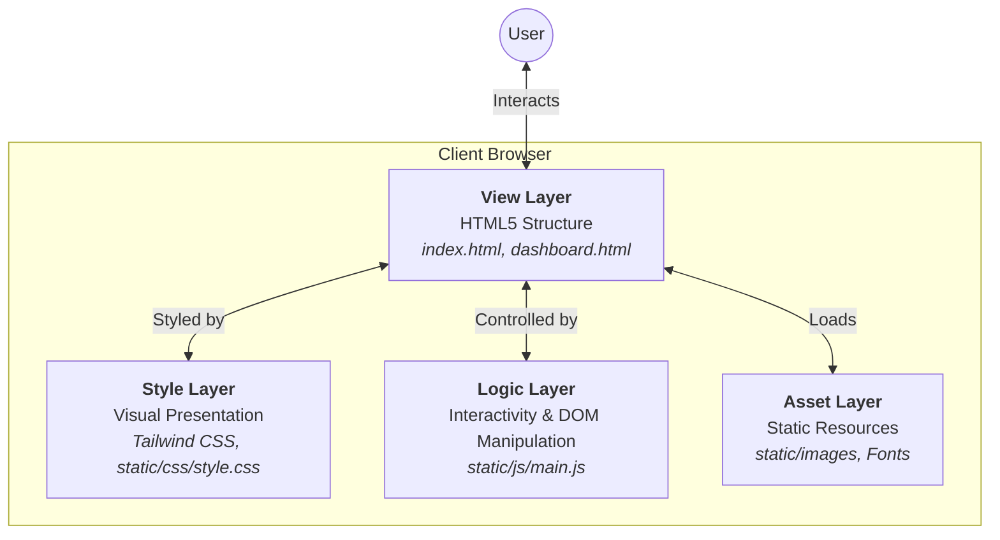

# BeatCoders

BeatCoders is a modern web application designed for coding enthusiasts. It features a sleek, responsive user interface with a focus on user experience and aesthetics.

## 🚀 Features

*   **Modern UI/UX:** Built with a clean, glassmorphism-inspired design.
*   **Responsive Layout:** Fully responsive design that works seamlessly on desktop and mobile devices.
*   **Dark/Light Mode:** Built-in theme switching capabilities.
*   **Dashboard:** A comprehensive user dashboard for tracking progress and activities.
*   **Landing Page:** An engaging entry point for the application.

## 🔮 Future Roadmap

*   **1v1 "Rap Battle" Coding:** Real-time competitive coding where passing test cases deals "damage" to the opponent.
*   **AI "Producer" (Code Review):** Smart feedback agent that analyzes code style and logic, offering musical metaphors for feedback.
*   **Visualizer Debugger:** A debugger that visualizes data structures pulsating to a beat as algorithms traverse them.
*   **Email Invite System:** Invite offline friends via email links to join 1v1 battles.
*   **Code Efficiency Analyzer:** Intelligent system that analyzes submitted code for time/space complexity, provides tiered feedback (optimal/good/improvable/alternative), and offers educational hints and resources based on subscription tier.

## 🛠️ Tech Stack

*   **Core:** HTML5, JavaScript
*   **Styling:** [Tailwind CSS](https://tailwindcss.com/) (Utility-first CSS framework)
*   **Fonts:** Google Fonts (Inter, Poppins)
*   **Package Management:** npm

## 🏗️ Architecture

BeatCoders follows a **Client-Side Layered Architecture**. Since it is a static web application, all layers reside within the client's browser.



### Layer Breakdown

1.  **View Layer (HTML):**
    *   Defines the structure and semantic content of the application.
    *   Key files: `index.html` (Landing), `dashboard.html` (App Interface).

2.  **Style Layer (CSS):**
    *   Handles the look and feel, responsiveness, and theming (Dark/Light mode).
    *   Powered by **Tailwind CSS** for utility-first styling and custom overrides in `static/css/style.css`.

3.  **Logic Layer (JavaScript):**
    *   Manages user interactions, state changes (e.g., theme toggling), and dynamic content updates.
    *   Key file: `static/js/main.js`.

4.  **Asset Layer:**
    *   Contains static resources like images, icons, and fonts served from the `static/` directory.


### File Structure

```
BeatCoders/
├── index.html          # Landing page
├── dashboard.html      # User dashboard
├── package.json        # Project dependencies and scripts
├── static/             # Static assets directory
│   ├── css/            # Custom stylesheets
│   └── ...             # Other assets
└── .gitignore          # Git ignore file
```

## 📦 Installation & Setup

1.  **Clone the repository:**
    ```bash
    git clone https://github.com/shrey0196/beatcoders-dev.git
    cd beatcoders-dev
    ```

2.  **Install dependencies:**
    ```bash
    npm install
    ```

3.  **Running the project:**
    Since this is primarily a static site, you can open `index.html` or `dashboard.html` directly in your browser.
    
    For a better development experience, you can use a live server extension (like Live Server in VS Code) or run a simple HTTP server:

    ```bash
    npx serve .
    ```

## 🤝 Contributing

Contributions are welcome! Please feel free to submit a Pull Request.
